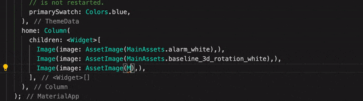

# Assets Scanner
[](https://cirrus-ci.com/github/amorenew/assets_scanner_plus) 
[](https://pub.dev/packages/assets_scanner_plus)

As you know, you need to use the image path to [load image](https://flutter.dev/docs/development/ui/assets-and-images#loading-images-1) in Flutter
, e.g., `AssetImage('graphics/background.png')`. However, this approach is prone to errors, such as the spelling of the path, you can only find this error after the program runs, and you may not be able to intuitively know which picture this is through the path. Assets Scanner helps you generate constants for assets, reducing the probability of misspellings. At the same time, you can hover over the constants to preview the images more intuitively.

## Usage
In your `pubspec.yaml`, add the following:
```yaml
dev_dependencies:
    assets_scanner_plus: ^1.0.0
```
Then run `flutter packages pub run build_runner build`, **assets_scanner_plus** will generate a `r.dart` file in the `lib/` for you, such like below:
```dart
/// GENERATED BY assets_scanner_plus. DO NOT MODIFY BY HAND.
/// See more detail on https://github.com/amorenew/assets_scanner_plus.
class R {
  static const package = "example";

  /// 
  static const baseline_3d_rotation_white = "assets/baseline_3d_rotation_white.png";

// ignore_for_file:lines_longer_than_80_chars,constant_identifier_names
}
```

> **NOTE:** 
> * For [package assets](https://flutter.dev/docs/development/ui/assets-and-images#bundling-of-package-assets), it will generate another class according to the package name.
>
> * If the asset's name is not a legal dart identifier, the illegal characters will be converted to `_`, .e.g, the asset name `2TXsXk.jpg!w1280h1000.jpg` will generate the property name `r_2TXsXk_jpg_w1280h1000`.

By default, `assets_scanner_plus` will generate a `r.dart` file in your `lib` folder. If you want to change the default behavior, you can add an `assets_scanner_plus_options.yaml` file in your project's root folder.

```yaml
# The path where the generated file locate.
# Note that the `path` should be sub-path of `lib/`.
path: lib/generated

# The class name of the generated file.
className: R

# The file name of the generated file.
fileName: assets.dart

# Indicate the comments need to be generated or not.
# Note that the you can't preview the images assets if `ignoreComment` is `true`.
ignoreComment: false
```

Then `assets_scanner_plus` will generate a `assets.dart` file with class name `R` in your `lib/generated` folder.

## Previewing assets
Now, you can preview images assets by hovering to the constants:



### Custom the `assets_scanner_plus_options.yaml`
By default, **assets_scanner_plus** generate the `r.dart` in the `lib/`, the class name with `R`, etc. You can custom some options by adding a `assets_scanner_plus_options.yaml` file, the supported keys list below:
* `path`: The path where the `r.dart` file locate. Note that the `path` should be sub-path of `lib/`.

* `className`: The class name of the `r.dart`.

* `fileName`: The file name of the generated file.

* `ignoreComment`: Indicate the comments need to be generated or not. Note that the you can't preview the images assets if `ignoreComment` is `true`.

Here the example of the `assets_scanner_plus_options.yaml` file:
```yaml
# assets_scanner_plus_options.yaml

path: "lib/src"
className: "MainAssets"
fileName: "assets.dart"
ignoreComment: true
```

## License
    Copyright (C) 2024 amorenew

    Licensed under the Apache License, Version 2.0 (the "License");
    you may not use this file except in compliance with the License.
    You may obtain a copy of the License at

        http://www.apache.org/licenses/LICENSE-2.0

    Unless required by applicable law or agreed to in writing, software
    distributed under the License is distributed on an "AS IS" BASIS,
    WITHOUT WARRANTIES OR CONDITIONS OF ANY KIND, either express or implied.
    See the License for the specific language governing permissions and
    limitations under the License.